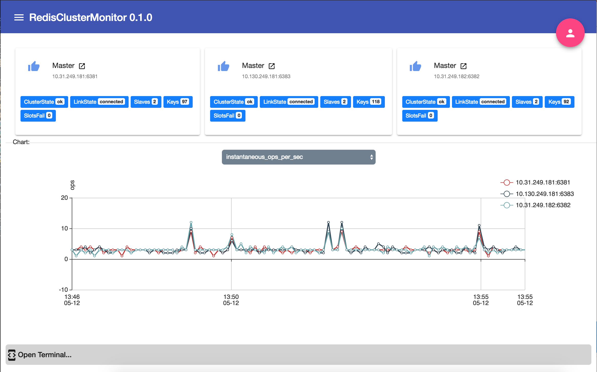

# Redis Cluster Monitor

This tool actively monitors a Redis Cluster and provides an interactive webpage console with which to interact with keys in the cluster, independent of the key's node within the cluster.

It provides an Angular5 frontend which consumes data from, and is provided by, a Python2.7 Flask backend.


# Documentation

## Explicit Prerequisites:
* angular cli (ng)
* npm
* python 2.7
* docker (if deploying through docker)

## Installation+Run via Docker (Basic)
1. Download the latest version from GitHub
 
   ```
   git clone https://github.com/booleys1012/redisclustermon.git
   cd redisclustermon
   ```
2. Update environment.ts in client/src/environments by replacing `localhost` with the hostname of the server running the docker image
3. build the docker image (tag name is rcm)
   ```
   make docker
   ```
   
   Note: this builds the python package, builds the angular client and then builds the docker image with the Dockerfile provided
   
4. run the docker container, specifying the redis startup nodes in the container environment
   ```
   docker run -d --name rcmcontainer \
     -e RCM_REDIS_STARTUP_NODES='host1:port1,host2:port2' \
     -p 80:80 rcm
   ```
5. Check out the frontend at 127.0.0.1:80/index.html

## Installation+Run from the CommandLine (Basic, **painful**)

1. Download the latest version from GitHub
 
   ```
   git clone https://github.com/booleys1012/redisclustermon.git
   cd redisclustermon
   ```
2. build the python pyrcm package (places the package
   ```
   make pyrcm
   ```
3. create a new python2.7 python virtual environment
   ```
   virtualenv $PATH_TO_VIRTUAL_ENVIRONMENT
   ```
3. activate the virtual environment
   ```
   source $PATH_TO_VIRTUAL_ENVIRONMENT/bin/activate
   ```
4. install the pip package built in #2
   ```
   pip install dist/redisclustermon-0.0.20180423.1.tar.gz
   ```
5. Update environment.ts in client/src/environments by replacing `localhost` with the hostname of the server running the docker image
6. build the client Angular frontend
   ```
   cd client;
   npm install;
   ng build;
   cd ..;
   ```
7. run the python service (**sudo if necessary**, for port-80 access)
   ```
   sudo STATIC_FOLDER="... SEE ENV VARS BELOW..." \
     RCM_REDIS_STARTUP_NODES="...SEE ENV VARS BELOW..." \
     FLASK_PORT=80 \
     rcm.py
   ```
8. Check out the frontend at 127.0.0.1:80/index.html


## Environment Variables
```
RCM_REDIS_STARTUP_NODES
   description: comma separated host:port of the redis nodes to connect to
   required: True
   default: <none>
   example: "redis01.blerg.com:6329,redis02.blerg.com:6329,redis03.blerg.com:6329"
   
   notes: None
```

```
STATIC_FOLDER
   description: path where the angular build is located
   required: False
   default: /app/static
   example: /app/static
   
   Notes: The default is set to the docker image settings. This will need
   to be modified for non-docker execution
```

```
FLASK_PORT
   description: the port that flask listens on
   required: False
   default: 80
   example: 8888
   
   Notes: sudo may be required for non-ephemeral ports, depending on 
   your system setttings
```

## Using the Frontend
	
### Front Page

* The main page displays a high-level overview of critical cluster node stats
* The main page graphs time-based statistics of each master in the cluster
* The terminal button reveals the terminal sidebar



### Terminal

* The terminal sidebar allows certain redis methods to be executed

## Gotchas

### Docker PIP install requires proxy

place the following into the Dockerfile, just prior to the PIP command
```
ENV http_proxy  http://PROXY_HOST:PROXY_PORT
ENV https_proxy http://PROXY_HOST:PROXY_PORT
```
It is optional to unset these after


## Next Steps

* utilize nginx/uwsgi in docker for production-quality webserver
* add additional commands for terminal
* additional charting
* update flask server to not require "index.html" in URL
* support python3
* TLS
* icon
 
## License & Authors

Copyright (c) 2013-2018 Justin Bewley Lo

MIT (See docs/LICENSE.txt file)
